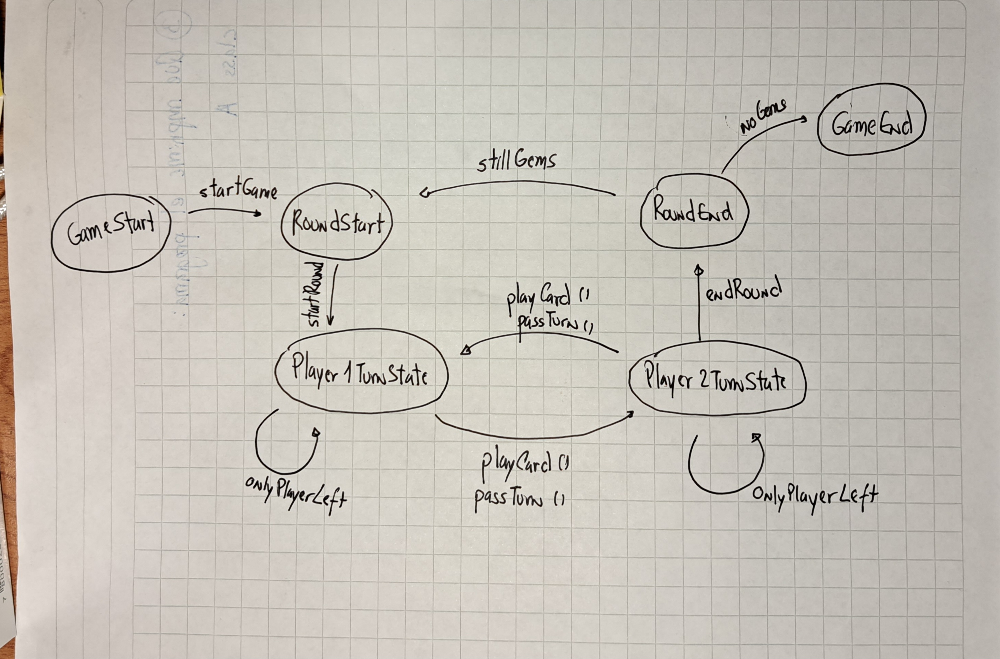

# Gwen't

This work is licensed under a
[Creative Commons Attribution 4.0 International License](http://creativecommons.org/licenses/by/4.0/)

Context
-------

This project's goal is to create a (simplified) clone of the
[_Gwent_](https://www.playgwent.com/en)card game developed by [_CD PROJEKT RED_](https://cdprojektred.com/en/)

---

**The rest of the documentation is left for the users of this template to complete**
# Explicación clases
**Jugador**: Esta clase es el constructor de los jugadores del juego Gwent, cada objeto Jugador es iniciado con un value nombre, y tres variables privadas, _mano, _mazo, _gemas.
**GameController**: Esta clase es unconstructor de controladores del juego, el controlador de encarga de seguir la progresión lógica del juego y maneja la transición entre
estados del juego.
# Diagrama de estados

